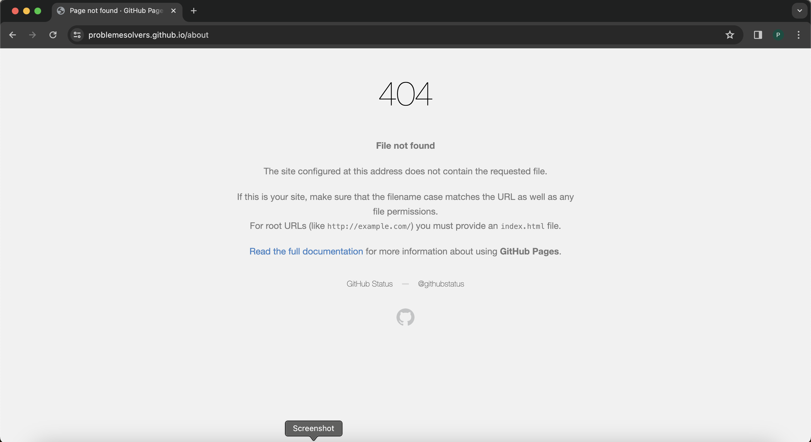

# GitHub Pages 404 Fix

⚡️🐞🧑‍🏫 How to resolve a common 404 error when deploying a SPA (single-page application) as static content to GitHub Pages

## Problem Description

After a SPA with client-side routing is deployed to Pages successfully, a "non-root" route of the app will return a 404 under the following conditions:

1️⃣ if the user refreshes the page<br />
2️⃣ if the user navigates a non-root route via the browser's address bar



## Solution Description

Add `404.html` to your `public` folder.<br/>
`404.html` should redirect to the root of your SPA (`index.html`) with a param of the route name the user requested.<br/>
Once the SPA's root is reached again, we can parse the URL to get the route name and navigate to it with the client-side router.

## Solution Steps

### **Step** 1️⃣, add `~/public/404.html` and following code:

```html
<!DOCTYPE html>
<html lang="en">
  <head>
    <!-- ... -->
  </head>
  <body>
    <div id="root"></div>
    <script src="/redirect.js"></script>
  </body>
</html>
```

### **Step** 2️⃣, add `~/public/redirect.js` and following code:

```javascript
(function () {
  window.location.href = `/${
    window.location.pathname
      ? `?lastRoute=${window.location.pathname.slice(1)}`
      : ""
  }`;
})();
```

### **Step** 3️⃣, add line after app is instantiated (e.g., `~/src/main.jsx`):

```diff
/** ... **/
ReactDOM.createRoot(document.getElementById("root")).render(
  <React.StrictMode>
    <RouterProvider router={router} />
  </React.StrictMode>
);

+router.navigate(window.location.href.split("?")[1].split("=")[1]);
```

### Done.

### `~/src/router.jsx` for reference:

```jsx
import { createBrowserRouter } from "react-router-dom";
import App from "./App/App";
import Home from "./Home";
import About from "./About";

export const router = createBrowserRouter([
  {
    path: "/",
    element: <App />,
    children: [
      {
        path: "/",
        element: <Home />,
      },
      {
        path: "/about",
        element: <About />,
      },
    ],
  },
]);
```
