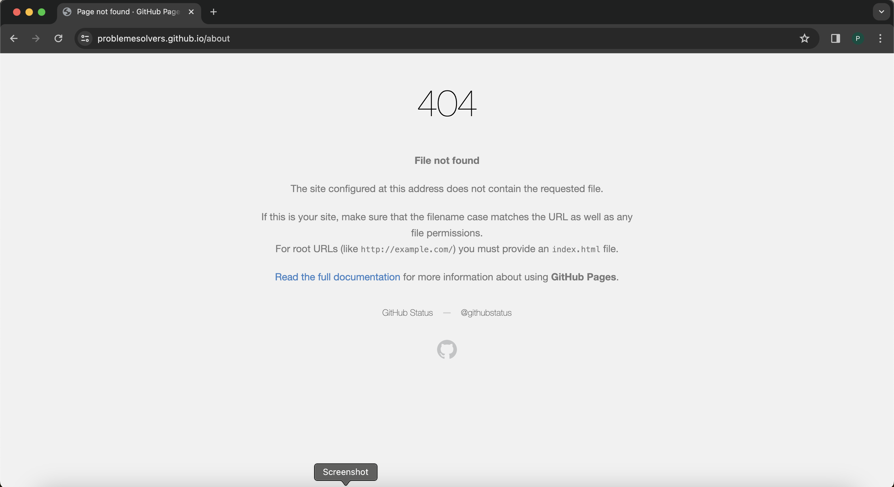

# GitHub Pages 404 Error Page Fix

⚡️🐞🧑‍🏫 How to resolve a common 404 error when deploying a SPA (single-page application) as static content to GitHub Pages

## Problem Description

After a SPA with client-side routing is deployed to Pages successfully, the app will return a 404-error page under the following conditions:

1️⃣ if the user refreshes the page on a <i>non-root</i> route<br />
2️⃣ if the user navigates via the browser's address bar to a <i>non-root</i> route



## Solution Description

Create a `404.html` and add it to your `public` folder.<br/>
`404.html` should redirect to the root of your SPA (`index.html`) with a param of the current route name (e.g., "`currentRoute`") the user requested.<br/>
Once the SPA returns to the root of the app once again, it can parse the URL to get the current route and navigate to it with the client-side router.

## `router` Solution Steps

### **Step** 1️⃣, add `~/public/404.html` and following code to it:

```html
<!DOCTYPE html>
<html lang="en">
  <head>
    <!-- ... -->
    <base href="/" />
  </head>
  <body>
    <div id="root"></div>
    <script src="/redirect.js"></script>
  </body>
</html>
```

### **Step** 2️⃣, add `~/public/redirect.js` and following code to it:

```javascript
(function () {
  window.location.href = `/${
    window.location.pathname
      ? `?currentRoute=${window.location.pathname.slice(1)}`
      : ""
  }`;
})();
```

### **Step** 3️⃣, add line after app is instantiated (e.g., `~/src/main.jsx`):

```diff
/** ... **/
ReactDOM.createRoot(document.getElementById("root")).render(
  <React.StrictMode>
    <RouterProvider router={router} />
  </React.StrictMode>
);

+router.navigate(window.location.href.split("?")[1]?.split("=")[1]);
```

### Done.

## `router` Solution References

### (1️⃣) 🏠 Go to [https://problemesolvers.github.io/about](https://problemesolvers.github.io/about) for a live example of the solution.

### (2️⃣) 🧮 Go to [https://github.com/problemesolvers/problemesolvers.github.io](https://github.com/problemesolvers/problemesolvers.github.io) for the example code of the solution.

### (3️⃣) 🚏 See `~/src/router.jsx` below for basic React Router reference:

```jsx
import { createBrowserRouter } from "react-router-dom";
import App from "./App/App";
import Home from "./Home";
import About from "./About";

export const router = createBrowserRouter([
  {
    path: "/",
    element: <App />,
    children: [
      {
        path: "/",
        element: <Home />,
      },
      {
        path: "/about",
        element: <About />,
      },
    ],
  },
]);
```

### (4️⃣) 🌐 See `~/src/main.jsx` below for basic web app instantiation reference:

```jsx
import React from "react";
import ReactDOM from "react-dom/client";
import { RouterProvider } from "react-router-dom";
import { router } from "./router";
import "./index.css";

ReactDOM.createRoot(document.getElementById("root")).render(
  <React.StrictMode>
    <RouterProvider router={router} />
  </React.StrictMode>
);

router.navigate(window.location.href.split("?")[1]?.split("=")[1]);
```

<br/>

---

<br />

There's another pattern to the solution that has the same effect documented below:

## `Routes` Solution Steps

### **Step** 1️⃣, add `~/public/404.html` and following code to it:

```html
<!DOCTYPE html>
<html lang="en">
  <head>
    <!-- ... -->
    <base href="/" />
  </head>
  <body>
    <div id="root"></div>
    <script src="/redirect.js"></script>
  </body>
</html>
```

### **Step** 2️⃣, add `~/public/redirect.js` and following code to it:

```javascript
(function () {
  window.location.href = `/${
    window.location.pathname
      ? `?currentRoute=${window.location.pathname.slice(1)}`
      : ""
  }`;
})();
```

### \*\*Step 3️⃣, ensure `Routes` have been added correctly in `App`:

```tsx
<AppShell.Main>
  <Center>
    <Routes location={location} key={location.pathname}>
      <Route
        path="/"
        element={
          <Navigate
            to={`/${
              window.location.href.split("?")[1]?.split("=")[1] ?? "home"
            }`}
            replace
          />
        }
      />
      <Route path="/home" element={<Home />} />
      <Route path="/about" element={<About />} />
      <Route path="/contact" element={<Contact />} />
      <Route path="/*" element={<PageNotFound />} />
    </Routes>
  </Center>
</AppShell.Main>
```

### Done.

## `Routes` Solution References

### (1️⃣) 🏠 Go to [https://pjnalls.github.io/about](https://pjnalls.github.io/about) for a live example of the solution.

### (2️⃣) 🧮 Go to [https://github.com/pjnalls/pjnalls.github.io](https://github.com/pjnalls/pjnalls.github.io) for the example code of the solution.

### (4️⃣) 🌐 See `~/src/main.tsx` below for basic web app instantiation reference:

```tsx
import React from "react";
import ReactDOM from "react-dom/client";
import { BrowserRouter } from "react-router-dom";
import { MantineProvider } from "@mantine/core";
import "@mantine/core/styles.css";

import App from "./pages/App";
import "./styles/index.scss";

ReactDOM.createRoot(document.getElementById("root")!).render(
  <React.StrictMode>
    <MantineProvider defaultColorScheme={"auto"}>
      <BrowserRouter>
        <App />
      </BrowserRouter>
    </MantineProvider>
  </React.StrictMode>
);
```
